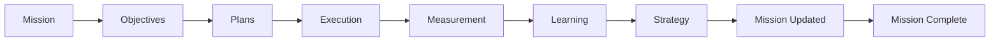

# ADR-009: Mission Engine

## Status

Accepted

## Context

VGOS v5.0 had strong domain objects for intelligence, planning, execution, measurement, learning, and strategy feedback. Those layers could explain work, but they did not have one highest-level business object that represented an outcome VidMaker is trying to win.

Without that layer, Mission Control could still feel like a collection of dashboards instead of an operating system. Objectives, plans, execution items, metrics, learnings, and strategy adjustments needed to roll up into a durable business mission.

## Decision

VGOS v5.1 introduces `Mission` as the top-level operating object. A mission owns the business outcome and links to objectives, plans, execution items, metrics, learnings, and summaries through explicit join models.

The Mission Engine is rule-based for now and exposes reusable services for:

- Mission creation, update, archive, and completion.
- Mission health, confidence, velocity, risk, and completion scoring.
- Mission summaries and founder/executive briefs.
- Mission insights, stagnation detection, and recommended changes.
- Mission templates for authority, SEO, AEO, GEO, content, community, product, launch, growth, and revenue work.

## Data Flow

## Consequences

- Mission Control can start with mission health instead of lower-level activity counts.
- Objectives and plans can be converted into missions without changing their existing models.
- Execution, measurement, and learning can roll up into business-level confidence and risk.
- Future AI providers can generate mission summaries or recommendations through the same service boundary.
- Workspace scoping remains intact because Mission and all mission join models carry `workspaceId`.

## Follow-Ups

- Add persisted mission health history when database-backed views replace the local state shell.
- Add server actions for mission summary generation once authentication and workspace membership are introduced.
- Add mission-specific permissions before external workflows can publish content or outreach.
