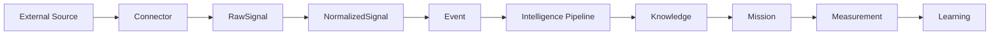

# ADR-010: Connected Intelligence

## Status

Accepted

## Context

VGOS already has a kernel-first operating loop from signals to intelligence, knowledge, memory, planning, execution, measurement, learning, and mission intelligence. The next risk is allowing future external integrations to bypass that kernel and write directly into dashboards or mission views.

Connected Intelligence prepares VGOS for live external sources without implementing full OAuth flows yet.

## Decision

All external data must enter through a connector and move through this sequence:

Connectors are provider adapters. They do not write directly to Mission Control. Connector syncs produce raw signals, normalization turns provider-specific payloads into stable `NormalizedSignal` records, and the signal router creates existing VGOS objects such as questions, observations, content assets, metrics, measurements, attributions, and knowledge objects.

The first release ships mock/live-ready connectors for Google Search Console, Google Analytics, GitHub, Product Hunt, Reddit, LinkedIn, X, YouTube, Newsletter, CMS, and Manual Import.

## Consequences

- OAuth and live API credentials can be added later without changing the kernel data flow.
- Mission Control can summarize external source health without becoming a connector runtime.
- Normalized signals provide a stable contract between provider payloads and VGOS domain objects.
- Failed signals and connector health become first-class operational concerns.

## Follow-Ups

- Add secure credential storage before enabling real OAuth or API-key connectors.
- Add scheduled background jobs for sync cadence.
- Add webhook verification for providers that support event-driven updates.
- Add deduplication by connector, external ID, signal type, and occurred timestamp.
