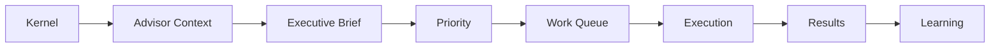

# ADR-013: Executive Intelligence Experience

## Status

Accepted

## Context

VGOS already has mission, planning, execution, measurement, quality, and connected intelligence layers. The next product step is not another backend engine. It is a calmer founder/operator experience that turns existing state into plain-language decisions, daily priorities, explainable recommendations, and a focused work queue.

## Decision

Executive Brief becomes the primary landing experience at `/executive-brief`. The root route redirects there so the first screen after login is executive-facing.

The existing Mission Control surface is renamed System Mission Control and moved under Intelligence Studio navigation. It remains available for deeper operational inspection.

A rule-based Advisor workspace is added at `/advisor`. The advisor uses workspace-scoped VGOS state only. It answers natural-language operating questions with an answer, reasoning, related objects, suggested actions, and confidence. No external AI API is required.

A simplified Work Queue is added at `/work-queue`. It groups today's work, ready items, blocked items, approval-needed items, overdue work, and completed-today items. It reuses the existing execution actions for start, complete, evidence, approval, block, and snooze.

Results now present plain-language wins, measurements, learnings, strategy adjustments, and mission progress before detailed records.

Persona modes shape navigation and emphasis:

- Founder: brief, missions, work queue, results, advisor, settings.
- Marketing: campaigns/content, approvals, results, recommendations.
- SEO: keywords, AEO/GEO, content clusters, backlinks, search performance.
- Product: feedback, blockers, feature requests, product signals, execution results.
- Developer: technical pages, connectors, signals, pipelines, capabilities, audit logs, system health.

## Data Flow

## Consequences

- The primary VGOS experience reads like an executive assistant instead of an engineering dashboard.
- Technical pages remain accessible through Intelligence Studio and Developer persona.
- Advisor logic stays deterministic and workspace-scoped, so future AI integration can replace only the answer layer.
- The UI uses the current in-memory seeded state and existing execution handlers, preserving current app behavior.
- Recommendations expose supporting evidence, related signals, related mission, confidence, expected impact, and missing evidence.

## Future Considerations

- Persist generated briefs and advisor answers as auditable workspace artifacts.
- Add user-specific persona preference persistence.
- Replace or augment the rule-based advisor with an external AI API once governance, citations, and audit requirements are defined.
- Add direct route synchronization for internal shell navigation if multi-page persistence becomes important.
