# ADR-014: Reflective Cognition & Executive Wisdom

## Status

Accepted

## Context

VGOS already has intelligence, recommendations, missions, planning, execution, measurement, learning, Advisor, Executive Brief, connected intelligence, and quality scoring. The next improvement is not more automation or another primary dashboard. VGOS needs better judgment: explicit assumptions, assessed evidence, counter-evidence, tradeoffs, uncertainty, and learning from whether recommendations worked.

## Decision

Add a lightweight reflective cognition kernel under `src/kernel/cognition`.

The kernel owns deterministic, rule-based functions for:

- extracting and explaining assumptions
- assessing evidence quality
- identifying counter-evidence
- comparing tradeoffs
- generating executive judgment
- creating reflections from execution, measurement, and learning
- recalibrating future recommendation confidence

Four supporting record families are added:

- Assumption
- EvidenceAssessment
- TradeoffAnalysis
- Reflection

These records are workspace scoped and link back to existing source records by `sourceType` and `sourceId`. They complement Recommendation, Learning, Measurement, ExecutionResult, StrategyAdjustment, Mission, and Advisor structures rather than replacing them.

## Data Flow

```mermaid
flowchart LR
  A["Observation"] --> B["Interpretation"]
  B --> C["Assumption"]
  C --> D["Evidence"]
  D --> E["Counter-Evidence"]
  E --> F["Trade-off"]
  F --> G["Judgment"]
  G --> H["Recommendation"]
  H --> I["Execution"]
  I --> J["Reflection"]
  J --> K["Recalibration"]
  K --> L["Future Judgment"]
```

## Integration

Advisor answers now include direct answer, reasoning, assumptions, evidence, counter-evidence, tradeoff, confidence explanation, what would change the recommendation, and suggested next action.

Executive Brief includes an Executive Judgment section with the strongest recommendation, main assumption, counter-risk, tradeoff, confidence, and what would change the recommendation.

Work Queue items include an expandable "Why this work matters" section with mission, expected impact, evidence strength, assumptions, counter-risk, and tradeoff.

Mission detail includes high-risk assumptions, weak evidence areas, major tradeoffs, reflections, and judgment confidence.

Supporting pages exist at `/assumptions`, `/evidence`, `/tradeoffs`, and `/reflections`.

## Consequences

- VGOS becomes more trustworthy without adding an external AI dependency.
- Confidence is now more explainable because it is adjusted by evidence quality, high-risk assumptions, and counter-evidence.
- Recommendations can acknowledge uncertainty and name what would change the decision.
- Reflections create a feedback loop from execution outcomes back into future judgment.
- Supporting pages remain secondary to Executive Brief, Advisor, Work Queue, and Missions.

## Future Considerations

- Persist generated executive judgments as auditable records.
- Add user-facing controls for marking assumptions validated or invalidated from measurement review.
- Fold repeated wrong assumptions into priority scoring and planning defaults.
- Add connector freshness as a stronger factor in judgment confidence once live data is connected.
