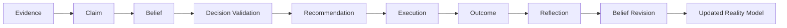

# ADR-015: Belief, Claim & Decision Validation

## Status

Accepted

## Context

VGOS can already rank recommendations, track evidence, deliberate between options, and reflect on outcomes. The missing layer is a clear model for what VGOS believes, which claims support those beliefs, and whether current decisions are aligned with that reality.

Without this layer, a recommendation can look confident because it is urgent, high-impact, or recently discussed, even when the supporting belief is weak or challenged.

## Decision

Add a lightweight, deterministic validation layer under `src/kernel/beliefs`.

The layer introduces:

- Claim
- ClaimEvidence
- Belief
- BeliefClaim
- BeliefRevision
- DecisionValidation
- RealityModel

Claims are evidence-backed statements. Beliefs are higher-order operating truths that can be supported, challenged, revised, or retired. Decision validations compare recommendations, decisions, and missions against current beliefs and claims.

This does not add a new cognitive engine. It strengthens the existing recommendation, Advisor, Executive Brief, and Deliberation surfaces by making their assumptions explicit and revisable.

## Data Flow

## Integration

Advisor can answer belief, claim, reality model, and decision validation questions.

Executive Brief includes belief updates so operators can see what changed in VGOS judgment.

Major recommendations show supported beliefs, challenged beliefs, supporting claims, evidence strength, belief alignment, and whether more evidence is needed.

New inspection pages exist at `/claims`, `/beliefs`, `/belief-revisions`, `/decision-validations`, and `/reality-model`.

## Consequences

- VGOS can explain what it believes, not only what it recommends.
- Weak or challenged claims can keep decision risk visible.
- Belief revisions make confidence changes auditable.
- Recommendations become safer because belief alignment and missing evidence are visible before execution.
- The Reality Model becomes the interpreted operating view, not a raw log of records.

## Future Considerations

- Connect live signals to claim creation after connector events are durable.
- Let repeated outcomes update belief confidence automatically.
- Add richer contradiction detection between claims.
- Promote stable beliefs into reusable strategy rules.
