# ADR-015: Deliberation Layer

## Status

Accepted

## Context

VGOS v6.2 added reflective cognition: assumptions, evidence, counter-evidence, tradeoffs, reflections, and executive judgment. That makes recommendations more explainable, but VGOS still needs a stronger step before committing scarce execution capacity. Some operating moments are not simple ranking problems. They are decisions with alternatives, risk, rejected paths, dissent, and a later need to review whether the judgment was sound.

## Decision

Add a lightweight deliberation kernel under `src/kernel/deliberation`.

The kernel owns deterministic, rule-based functions for:

- creating decision situations from recommendations, mission risk, signals, and work queue conflicts
- generating decision options
- evaluating options across impact, effort, risk, evidence, alignment, and urgency
- challenging options with weaknesses, missing evidence, failure modes, and dissenting views
- generating a final deliberation and commitment
- reviewing decision outcomes and turning judgment quality into future rules

Six supporting record families are added:

- DecisionSituation
- DecisionOption
- OptionEvaluation
- Deliberation
- DecisionCommitment
- DecisionReview

These records are workspace scoped and may link to missions, objectives, execution items, and plan items. They complement the Decision Engine and Reflective Cognition layer rather than replacing priority ranking.

## Data Flow

```mermaid
flowchart LR
  A["Signal or Work Conflict"] --> B["Decision Situation"]
  B --> C["Options"]
  C --> D["Option Evaluation"]
  D --> E["Option Challenge"]
  E --> F["Deliberation"]
  F --> G["Decision Commitment"]
  G --> H["Execution or Monitoring"]
  H --> I["Decision Review"]
  I --> J["Future Deliberation Rule"]
```

## Integration

Advisor can now answer option-aware questions: what VGOS chose, what it rejected, why it should or should not defer, whether doing nothing is viable, which option is best risk-adjusted, and which decision needs review.

Executive Brief includes a Decision Needed section for the highest-urgency open decision.

Work Queue surfaces a capacity decision when multiple high-priority execution items compete.

Mission detail shows open decisions, deliberations, commitments, reviews, and decisions that changed strategy for that mission.

Supporting pages exist at `/decisions`, `/deliberations`, and `/options`.

## Consequences

- VGOS can explain not only what it recommends, but which alternatives it considered and rejected.
- Decisions become reviewable records instead of transient ranking output.
- Work Queue can stop treating capacity conflicts as ordinary sorting problems.
- Mission strategy changes can be tied to explicit deliberations and commitments.
- Reviews create a feedback loop from outcome quality back into future decision rules.

## Future Considerations

- Add persisted option challenge records if audits require line-item challenge history.
- Add user-facing review workflows that compare commitment outcomes to original confidence.
- Let repeated weak decision patterns adjust future option scoring.
- Promote high-quality decision reviews into reusable playbooks for similar future situations.
