# ADR-016: Deliberation & Decision Quality

## Status

Accepted

## Context

Kernel 1.0 gave VGOS primitives for observations, claims, decisions, commitments, outcomes, reflections, capabilities, constraints, and state transitions. The existing deliberation layer already compares decision situations and options before commitment, but important decisions also need a quality gate: evidence, assumptions, tradeoffs, objections, confidence, reversibility, and rationale should be inspectable before VGOS turns a judgment into capacity.

## Decision

Add a Deliberation & Decision Quality layer under `src/kernel/deliberation`.

The layer adds deterministic records and functions for:

- explicit deliberations with options, assumptions, tradeoffs, objections, and linked evidence
- transparent decision-quality scoring across evidence quality, assumption clarity, option coverage, tradeoff clarity, risk visibility, reversibility, and confidence justification
- warnings for weak evidence, untested assumptions, unresolved objections, unjustified confidence, irreversible low-confidence decisions, and commitments without rationale
- readiness recommendations before decisions become commitments
- Executive Brief, Advisor, Work Queue, and Organizational VM integration without a large dashboard or schema migration

## Data Flow

```mermaid
flowchart LR
  A["Observation"] --> B["Claim"]
  B --> C["Deliberation"]
  C --> D["Options"]
  D --> E["Assumptions"]
  E --> F["Tradeoffs"]
  F --> G["Objections"]
  G --> H["Decision Quality Score"]
  H --> I["Decision"]
  I --> J["Commitment"]
  J --> K["Execution"]
  K --> L["Outcome"]
  L --> M["Reflection"]
  M --> N["State Transition"]
```

## Consequences

- VGOS can explain why a decision is ready, weak, or blocked before commitment.
- Advisor answers can cite evidence, assumptions, tradeoffs, objections, confidence, and next action from primitives.
- Work Queue can surface judgment-improvement tasks such as validating assumptions or resolving objections.
- Commitments and state transitions can carry decision-quality warnings without requiring Prisma schema changes.

## Future Considerations

- Persist deliberation assumptions, objections, tradeoffs, and quality scores once the data model stabilizes.
- Add review workflows that compare quality score at commitment time with outcome quality after execution.
- Feed repeated weak-decision patterns into future option scoring and confidence calibration.
