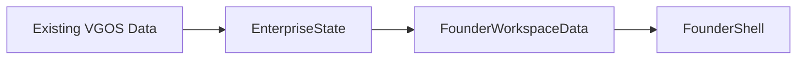

# ADR-016: Enterprise State Foundation

## Status

Accepted

## Context

Founder OS Alpha introduced a usable daily founder workspace at `/founder`. That workspace used Founder OS-specific demo and state builders to summarize the enterprise, daily win, priorities, open decisions, pulse, radar, opportunities, risks, next action, and reflection prompts.

That made the experience useful, but it left the Founder OS data path too close to the UI. Founder OS needs a canonical operating state that can be updated by existing VGOS data today and by live VidMaker operations later.

## Decision

Introduce `EnterpriseState` in `src/lib/enterprise-state.ts`.

`EnterpriseState` is the canonical runtime object for Founder OS. It contains the current enterprise identity, generated timestamp, health, focus, narrative, daily win, priorities, decision summaries, pulse, radar, opportunities, risks, next action, and reflection prompts.

Founder OS should render state. It should not generate intelligence inside React components or become a new cognitive engine. The current data path is:

`src/lib/founder-os.ts` remains as the compatibility adapter for the existing Founder Workspace UI contract. The UI can keep consuming `FounderWorkspaceData` while the runtime source becomes `EnterpriseState`.

## Integration

The initial `EnterpriseState` is composed from existing VGOS concepts:

- missions
- decisions and deliberations
- priorities
- reflections
- recommendations
- advisor outputs
- existing demo/state data where needed

The `/founder` route stays simple:

1. get `EnterpriseState`
2. map it to `FounderWorkspaceData`
3. render `FounderShell`

No new pages, React business logic, or intelligence engines are added.

## Future Data Flow

Future data sources should update `EnterpriseState` through events and connectors. Live VidMaker operations can flow through connected intelligence, normalized signals, mission updates, work queue changes, decisions, learnings, and reflection records before Founder OS renders them.

This keeps Founder OS focused on operating clarity: where the enterprise is, what the win is today, which three priorities matter, which decision needs attention, and what the founder should do now.

## Consequences

- Founder OS now has a canonical state object to render.
- Founder Workspace remains stable because `FounderWorkspaceData` is preserved.
- The app is prepared for live VidMaker operations without redesigning the UI.
- Intelligence generation remains in existing VGOS kernel and data layers.
- Future connectors can improve state freshness without changing Founder components.
