# ADR-017: Commitment Risk & Execution Integrity

## Status

Accepted

## Context

Deliberation & Decision Quality helps VGOS avoid weak decisions before they become commitments. That still leaves a second risk: a sound decision can become a weak outcome if the commitment has unclear ownership, missing evidence, unresolved dependencies, drift from original intent, or no measurable outcome loop.

## Decision

Add a Commitment Risk & Execution Integrity kernel under `src/kernel/commitments`.

The layer owns deterministic, rule-based functions for:

- execution readiness checks across owner, rationale, evidence, decision link, success criteria, resources, dependencies, blockers, and due date
- commitment risk profiles across ownership, resources, dependencies, evidence, deadline, drift, and execution risk
- commitment integrity scoring across decision alignment, evidence traceability, owner clarity, readiness, progress visibility, drift control, and outcome measurability
- drift signals, escalation records, and monitoring plans
- shared summaries for Executive Brief, Advisor, Work Queue, and Organizational VM

## Data Flow

```mermaid
flowchart LR
  A["Observation"] --> B["Claim"]
  B --> C["Deliberation"]
  C --> D["Decision"]
  D --> E["Commitment"]
  E --> F["Commitment Risk"]
  F --> G["Execution Readiness"]
  G --> H["Monitoring Plan"]
  H --> I["Execution"]
  I --> J["Outcome"]
  J --> K["Reflection"]
  K --> L["State Transition"]
  L --> M["Updated Organizational State"]
```

## Consequences

- Commitments can be sorted by risk and integrity before operator capacity is spent.
- Executive Brief can surface high-risk commitments without adding a new dashboard.
- Advisor can answer commitment-risk questions from owner, evidence, drift, and readiness primitives.
- Work Queue can turn integrity gaps into actionable tasks.
- Organizational VM state transitions can explain whether commitments reduce or increase organizational risk.

## Future Considerations

- Persist commitment risk profiles and monitoring plans once the schema stabilizes.
- Feed repeated drift patterns back into deliberation and planning heuristics.
- Compare commitment integrity at creation time with outcome quality after execution.
