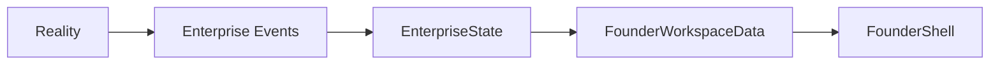

# ADR-017: Enterprise Events Reality Connectors

## Status

Accepted

## Context

Founder OS now renders `EnterpriseState` as the canonical operating state for the founder workspace. That gives `/founder` a stable data contract, but the next step is to prepare the state layer for real operational signals from the enterprise.

GitHub commits, pull requests, Vercel deployments, founder reflections, mission updates, decisions, content activity, product demos, and customer feedback should not flow directly into React components. Founder OS should remain an interpreted operating surface, not a raw event log.

## Decision

Introduce `EnterpriseEvent` in `src/lib/enterprise-events.ts`.

Enterprise Events are the bridge between reality and Founder OS. Connectors will emit lightweight events that describe what happened, where it came from, how severe it is, and what context belongs in the payload.

The first local data flow is:

For Alpha.3, events are local demo data. `EnterpriseState` uses rule-based interpretation to adjust pulse, radar, risks, recent events, and an event summary. No new cognitive engine is added.

## Interpretation

Founder OS should render interpreted enterprise state, not raw logs.

Examples:

- A successful Vercel deployment improves execution confidence.
- A failed Vercel deployment increases risk.
- A founder reflection improves learning.
- Published content improves growth and momentum.
- A completed product demo improves launch readiness.
- A pending product demo keeps proof asset risk visible.

The event timeline in Founder OS shows executive-language signals, limited to the five most recent events.

## Connector Targets

GitHub and Vercel are the first real connector targets.

The expected future connector path is:

1. Connector receives external signal.
2. Connector normalizes the signal.
3. Connector emits an `EnterpriseEvent`.
4. `EnterpriseState` derives the relevant operating interpretation.
5. Founder OS renders the interpreted state.

## Consequences

- Founder OS now has a foundation for reality-connected state.
- The existing Founder workspace remains stable.
- GitHub and Vercel can be connected later without redesigning Founder OS.
- React components stay free of business rules.
- Demo data can be replaced by connector output in a future sprint.
