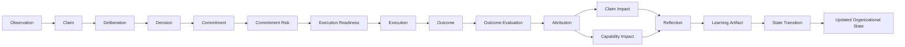

# ADR-018: Outcome Attribution & Learning Loop Integrity

## Status

Accepted

## Context

VGOS can already deliberate, commit, execute, measure, reflect, and brief the operator. The remaining risk is that outcomes can be recorded without a complete learning loop. A result might be reported as success without attribution, a failed outcome might unfairly discredit a sound decision, or a reflection might exist without updating the related claim, capability, or organizational state.

## Decision

Add an Outcome Attribution & Learning Loop Integrity kernel under `src/kernel/outcomes`.

The layer owns deterministic, rule-based functions for:

- comparing expected and actual outcomes without treating success as automatic decision validation
- attributing outcomes to likely sources with explicit confidence and evidence
- scoring whether the learning loop has evaluation, attribution, reflection, claim impact, capability impact, state transition, and reusable learning
- updating claims and capabilities from outcomes while preserving uncertainty
- converting outcomes into reusable learning artifacts and reflection-ready summaries
- providing shared summaries for Executive Brief, Advisor, Work Queue, commitments, and Organizational VM

## Data Flow

## Consequences

- VGOS can explain what happened, what likely caused it, and what changed.
- Advisor answers can include expected outcome, actual outcome, attribution, confidence, claim impact, capability impact, reusable learning, and next action.
- Executive Brief can surface outcome learning without adding another dashboard.
- Work Queue can generate tasks for missing outcomes, missing attribution, low-confidence attribution, missing reflections, stale claims, stale capabilities, and incomplete loops.
- Organizational VM state changes can explain what VGOS learned from outcomes.
- Claims and capabilities are updated only when evidence and confidence support the interpretation.

## Future Considerations

- Persist outcome evaluations and impacts once the schema is ready.
- Add richer causal models when connected measurement sources mature.
- Track repeated attribution misses as a decision-quality calibration signal.
- Promote high-confidence learning artifacts into planning and recommendation scoring.
