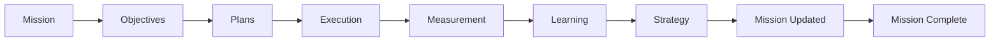
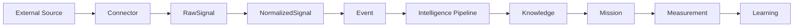

# VGOS Data Flow

```mermaid
flowchart LR
  A["Raw market signal"] --> B["Intelligence Pipeline"]
  B --> C["IntelligenceObject"]
  C --> D["KnowledgeObject"]
  D --> E["KnowledgeRelationship"]
  D --> F["MemorySnapshot"]
  F --> G["Pattern"]
  E --> H["Workflow"]
  G --> H
  H --> I["Agent Coordination"]
  I --> J["AIRecommendation"]
  J --> K["RecommendedAction"]
  K --> L["Plan"]
  L --> M["Milestone"]
  M --> N["Plan Item"]
  N --> O["ExecutionItem"]
  O --> P["ExecutionEvidence"]
  P --> Q["ExecutionResult"]
  Q --> R["Measurement"]
  R --> S["Learning"]
  S --> T["Attribution"]
  T --> U["Strategy Adjustment"]
  U --> V["Updated Plan"]
  V --> W["Better Recommendation"]
  W --> X["Mission Control"]
```

```mermaid
flowchart LR
  A["Objective"] --> B["Pattern"]
  B --> C["Recommendation"]
  C --> D["Plan"]
  D --> E["Milestone"]
  E --> F["Plan Item"]
  F --> G["ExecutionItem"]
  G --> H["Evidence"]
  H --> I["Result"]
  I --> J["Measurement"]
  J --> K["Learning"]
  K --> L["Attribution"]
  L --> M["Strategy Adjustment"]
  M --> N["Updated Plan"]
  N --> O["Better Recommendation"]
```

## Context

Phase Alpha gave VGOS memory, patterns, reasoning traces, objectives, agents, events, and decision ranking. Phase Beta makes those artifacts reusable through canonical knowledge objects, relationships, workflows, and handoffs. The Planning Engine adds structured execution planning on top of recommendations and constraints. The Execution Engine turns plans into owned execution items, proof, approvals, blockers, and results. The Measurement & Learning Engine turns those results into measurable evidence, learning, attribution, strategy adjustment, and better future recommendations. The Mission Engine rolls those layers into top-level business missions with health, velocity, risk, confidence, completion, summaries, and recommendations. Connected Intelligence prepares live external sources while requiring every connector to pass through raw signals, normalized signals, events, and kernel routing. Intelligence Quality adds a deterministic trust gate between normalization and downstream intelligence so quality scoring, duplicate detection, confidence calibration, and audit events happen before Mission Control acts on new recommendations.

## Decision

All significant market and growth artifacts can be represented as workspace-scoped knowledge objects. Relationships explain how those artifacts connect. Workflows and agents operate on the same knowledge layer rather than each module owning isolated logic. External sources enter through connectors, raw signals, normalized signals, and events before they reach intelligence or mission systems. Missions become the highest-level business objects. Plans translate objectives, patterns, and recommendations into milestones, plan items, dependencies, constraints, and predicted outcomes. Execution items translate planned work into shipped proof and measurable results. Measurements compare actual outcomes against expectations, then produce learnings, attributions, and strategy adjustments that can update mission strategy.

## Consequences

- Mission Control can summarize knowledge, workflow, agent, and decision layers from one state model.
- Semantic search can start with mock keyword similarity and later switch to embeddings without changing the product pages.
- Workflows can begin as deterministic runs and later call external AI services or background job queues.
- Planning connects strategic decisions to sequenced execution and expected outcomes.
- Execution connects plan items and recommendations to evidence, blockers, approvals, and results.
- Measurement connects execution results to metrics, learnings, attributions, strategy adjustments, updated plans, and better recommendations.
- Mission connects objectives, plans, execution, measurement, learning, and strategy into one business outcome with health and progress.
- Connected Intelligence connects external sources to VGOS through connectors, raw signals, normalized signals, events, and kernel routing.
- Intelligence Quality checks normalized signals, detects duplicates, calibrates recommendation confidence, and records audit events before enterprise workflows rely on new intelligence.

## Future Considerations

- Add durable vector storage when an embedding provider is available.
- Persist workflow execution logs with step-level retries and approvals.
- Add graph traversal APIs for multi-hop reasoning and source citation.
- Add approval gates before agents create external-facing content or outreach.
- Compare predicted outcomes with actual outcomes to improve planning confidence.
- Promote execution results and learnings into memory snapshots and future recommendation scoring.
