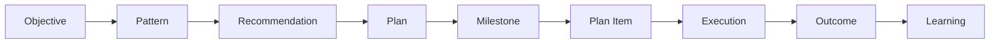

# VGOS Data Flow

```mermaid
flowchart LR
  A["Raw market signal"] --> B["Intelligence Pipeline"]
  B --> C["IntelligenceObject"]
  C --> D["KnowledgeObject"]
  D --> E["KnowledgeRelationship"]
  D --> F["MemorySnapshot"]
  F --> G["Pattern"]
  E --> H["Workflow"]
  G --> H
  H --> I["Agent Coordination"]
  I --> J["AIRecommendation"]
  J --> K["RecommendedAction"]
  K --> L["Plan"]
  L --> M["Milestone"]
  M --> N["Plan Item"]
  N --> O["Execution"]
  O --> P["Outcome"]
  P --> Q["Learning"]
  Q --> R["Mission Control"]
```

## Context

Phase Alpha gave VGOS memory, patterns, reasoning traces, objectives, agents, events, and decision ranking. Phase Beta makes those artifacts reusable through canonical knowledge objects, relationships, workflows, and handoffs. The Planning Engine adds structured execution planning on top of recommendations and constraints.

## Decision

All significant market and growth artifacts can be represented as workspace-scoped knowledge objects. Relationships explain how those artifacts connect. Workflows and agents operate on the same knowledge layer rather than each module owning isolated logic. Plans translate objectives, patterns, and recommendations into milestones, plan items, dependencies, constraints, and predicted outcomes.

## Consequences

- Mission Control can summarize knowledge, workflow, agent, and decision layers from one state model.
- Semantic search can start with mock keyword similarity and later switch to embeddings without changing the product pages.
- Workflows can begin as deterministic runs and later call external AI services or background job queues.
- Planning connects strategic decisions to sequenced execution and expected outcomes.

## Future Considerations

- Add durable vector storage when an embedding provider is available.
- Persist workflow execution logs with step-level retries and approvals.
- Add graph traversal APIs for multi-hop reasoning and source citation.
- Add approval gates before agents create external-facing content or outreach.
- Compare predicted outcomes with actual outcomes to improve planning confidence.
